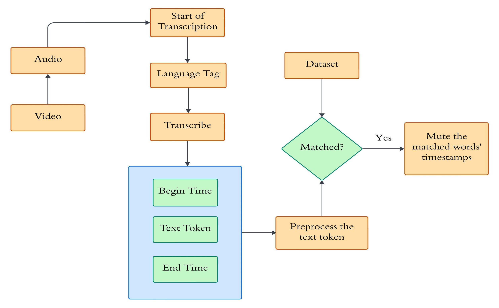
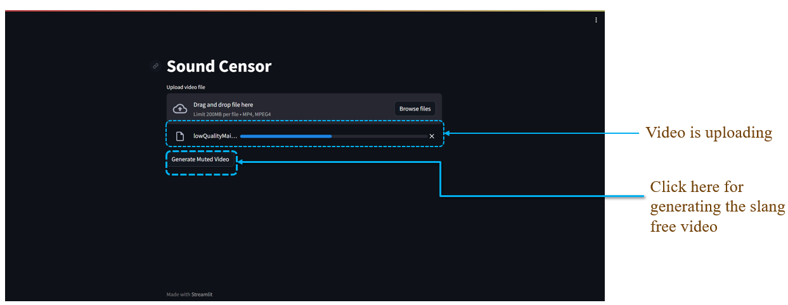
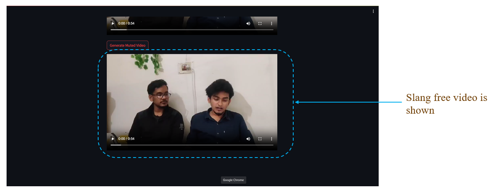

# Sound Censor: Automated Slang Detection for Profanity Filtering in Videos

---

## 🚀 **Introduction**  
Offensive content raises significant concerns, especially for younger audiences. The **Sound Censor** project aims to mute offensive and slang portions of any English video. Using our custom dataset of 2,648 words, the system accurately detects offensive language in multimedia content like movies and TV shows.

---

## 🎯 **Objectives**
- Detect and identify offensive language and slangs in video content.  
- Maintain **Contextual Integrity** to preserve the original meaning of the video.  
- Ensure a **user-friendly interface** for seamless adoption.  
- Facilitate **family-friendly content** to support shared viewing experiences.  

---

## 🛠️ **Workflow of the System**

1. **Language Identification**: If unspecified, the system automatically detects the language.
2. **Transcription**: Audio is converted into plain text.  
3. **Generate Word Level Timestamps**: Tokens are generated with corresponding timestamps.  
4. **Preprocessing**: Punctuation and whitespace are removed.  
5. **Comparison**: Words are matched with our dataset using unigram comparison.  
6. **Muting**: Offensive sections are muted in the video.  

---

## 🌟 **Graphical User Interface (GUI)**
### Input Example  
  
Users can upload videos for profanity filtering.  

### Output Example  
  
Filtered, slang-free video is displayed.  

---

## 🎁 **Contributions**
- Developed a web application to filter offensive slangs from videos.  
- Created a dataset of 2,648 slang words from various sources.  
- Designed a user-friendly GUI for broad accessibility.  

---

## ⚡ **Technologies Used**
- **Programming Languages**: Python  
- **Libraries/Frameworks**: TensorFlow, Flask, FFMPEG  
- **Frontend**: Streamlit  
- **Database**: Custom dataset  

---

## 🔗 **Contact**
For any queries, feel free to reach out at:  
📧 **mdkaisarulislam.kawshik@gmail.com**  
